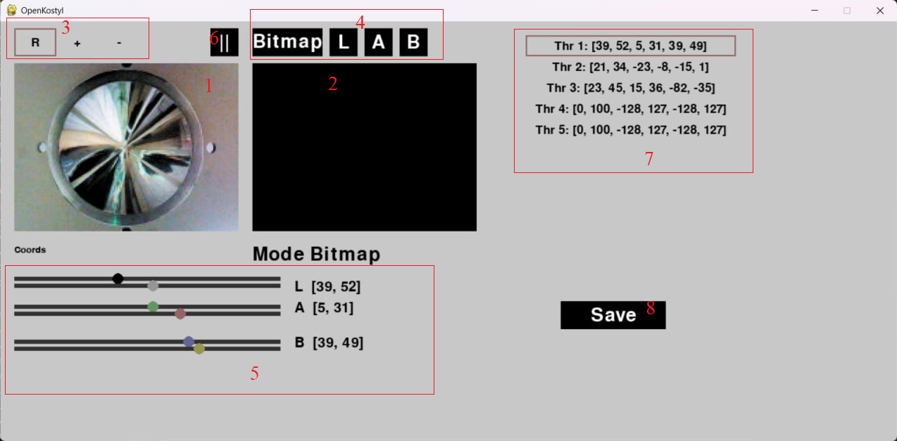

# OpenKostyl
Проект создан командой White Wings для упрощения и ускорения калибровки цветовых диапазонов на камерах OpenMV. Программа запускается на компьютере, обмениваясь информацией с камерой.

Актуальная версия: [UniKostyl](https://github.com/WildBoar228/UniKostyl)

За основу были взяты следующие материалы, предоставленные OpenMV:
* https://github.com/openmv/openmv/blob/master/scripts/examples/08-RPC-Library/34-Remote-Control/image_transfer_jpg_as_the_remote_device_for_your_computer.py
* https://www.youtube.com/watch?v=x0u_ntilVyA

В случае возникновения технических неполадок пишите: @wildboar228 (Telegram)

**Важно**: начиная с версии прошивки OpenMV 4.6.20 модуль для десктопной библиотеки rpc был зачем-то удален. Чтобы использовать OpenKostyl, откатитесь до более старой версии, пока проблема не будет решена.

## Начало использования
В файле requirements.txt перечислены зависимости проекта, которые можно установить на интерпретатор Python или в виртуальное окружение, введя в терминале `pip install -r requirements.txt`.

В папке cam_example находятся файлы для камеры:
* `connect_to_kostyli.py` - модуль, который содержит функционал для передачи данных в OpenKostyl. Поместите его в файловую систему камеры.
* `thresholds.txt` - текстовый файл с сохранёнными цветами. Поместите его в файловую систему камеры.
* `blobs.py` - файл, который нужно сохранить на камере как main.py с помощью OpenMV IDE. Если питание поступает на камеру через USB (т.е. камера подключена к компьютеру), скрипт обменивается информацией с OpenKostyl. Иначе (если питание идёт через другие каналы) скрипт читает цвета, перечисленные в файле `thresholds.txt`, и выполняет свою основную работу. Чтобы можно было отлаживать второй вариант при подключении к OpenMV IDE, закомментируйте строку кода `connect_to_kostyli.connect_to_comp()`, иначе вы получите ошибку (`OSError: cannot use USB_VCP while IDE is connected`).

Чтобы начать калибровку камеры, подключите её через USB-порт и запустите скрипт OpenKostyl.py.

**Обратите внимание**: подключение к камере, уже подключенной к OpenMV IDE, невозможно. Отключитесь от камеры в OpenMV IDE, чтобы OpenKostyl мог работать. Если это не помогло, физически переподключите камеру, чтобы она прекратила общение с OpenMV IDE.

OpenKostyl пытается автоматически выбрать COM-порт для соединения с камерой OpenMV. Если у него не получилось, введите название порта сами (например, COM11).

## Интерфейс и функционал

1. Изображение с камеры
2. Отфильтрованное изображение
3. Выбор режима выделения
4. Выбор режима отображения
5. Слайдеры для ручного регулирования трешолда
6. Пауза (не обновлять изображение)
7. Выбор трешолда для редактирования
8. Сохранить данные на камере в thresholds.txt

Чтобы быстро взять трешолд какого-либо объекта на изображении, выберите режим выделения `R`, выделите его мышью. Слайдеры автоматически подстроятся под крайние значения цветов. Отфильтрованное трешолдом изображение появится правее.

Представим, что вы взяли цвет объекта, вы остались довольны качеством, но затем переместили камеру, и с другого ракурса цвет объекта выглядит иначе. Чтобы учесть и этот ракурс, можно расширить трешолд. Для этого выберите режим выделения `+` и выделите объект повторно.

Режим выделения `-` (убрать помехи) находится в разработке, сейчас он не производит никаких действий.
